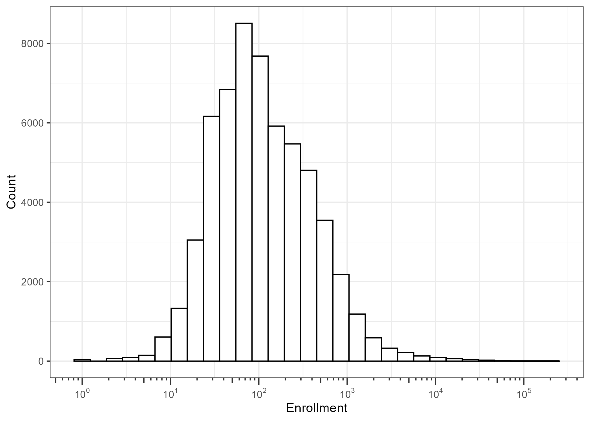
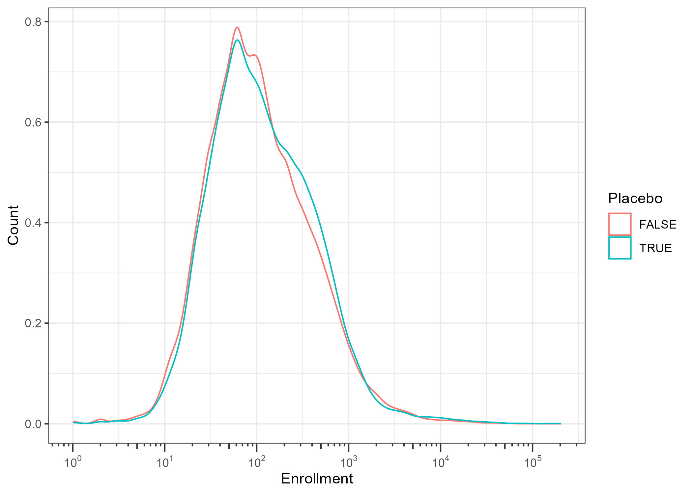

Sample size and duration of follow-up of randomized controlled clinical
trials
================
Tamás Ferenci (<tamas.ferenci@medstat.hu>)
<br>17 April, 2025

- [Motivation](#motivation)
- [Data extraction](#data-extraction)
- [Sample sizes](#sample-sizes)
- [Further development
  possibilities](#further-development-possibilities)

## Motivation

Randomized controlled trials (RCTs) are commonly referred to as the
“gold standard” for establishing the safety and efficacy of a drug, and
are now almost universally required for obtaining marketing
authorization for new pharmaceuticals. This designation is well-earned:
through randomization, RCTs can theoretically ensure that there are *no*
systematic differences between the groups being compared – aside from
their exposure to the drug. As a result, any observed differences in
outcomes – whether beneficial effects (efficacy) or adverse effects
(safety) – can be confidently attributed to the drug itself (alongside
random variability, which can be addressed statistically). In other
words, there is no
[confounding](https://www.annualreviews.org/content/journals/10.1146/annurev.publhealth.22.1.189).

The key phrase here is “at all”: randomization implies no differences
even in unknown or unmeasured variables – even in factors we are not
aware could act as confounders. This stands in sharp contrast to
observational studies, where we can only adjust for *known and measured*
confounders. These can be managed through design strategies like
restriction, or analytical methods such as stratification or regression
adjustment. However, these approaches are only effective for variables
we recognize as confounders and for which we have collected data (and
even then, limitations might remain, for example, the number of
confounders we can adjust for is constrained by the study’s sample
size). This is the most important strength of RCTs: their potential to
eliminate bias from confounding, giving them unique power in evaluating
drug effects.

The “theoretically” part is equally important: RCTs can be poorly
designed or executed, even in ways that reintroduce just the
confounding. RCTs can be executed poorly, even in ways that bring back
just the confounding. However, they at least offer the theoretical
possibility of being free of confounding in a sense of having zero bias
due to it – in an observational study we can never say, not even
theoretically, that there is “surely” no confounding.

That said, RCTs also have important limitations, two of which will be
examined here. First, RCTs typically have much smaller *sample sizes*
than observational studies. The latter can often include sample sizes
orders of magnitude larger (and achieving the same sample size is also
more feasible with an observational study). Second, RCTs usually have
much shorter *duration of follow-up* than observational studies.
Together, these limitations result in lower *statistical power* for
RCTs. This means that small effects – whether small desired effects, or
rare side effects – may be harder to detect in RCTs. (Side-effects that
appear non-linearly in time, i.e., the risk of which does not accumulate
linearly, but appears on after a certain time are also harder to detect,
due to the limited follow-up.)

But how significant is this limitation in practice? To explore this, it
is instructive to look at how large and how long RCTs can actually be.
We will investigate this using data from ClinicalTrials.gov.

The US National Library of Medicine’s ClinicalTrials.gov registry
(<https://clinicaltrials.gov/>) is a comprehensive
[database](https://clinicaltrials.gov/about-site/about-ctg) of RCTs,
launched in 2000. While submission is mandatory for trials regulated by
the FDA, sponsors and investigators from outside the US can also
register their studies. Because of its international recognition and
scope, the vast majority of significant RCTs are submitted to
ClinicalTrials.gov. This makes it an excellent resource for constructing
a broad and detailed picture of contemporary trials, both geographically
(covering studies worldwide) and temporally (spanning several decades).
It is also important that ehe database of ClinicalTrials.gov is publicly
accessible.

However, it’s important to acknowledge a key limitation: while
ClinicalTrials.gov likely captures nearly all relevant modern trials, it
does not include historical studies conducted before its inception. Case
in point, probably the largest RCT ever conducted was the [1954 field
trial](https://ajph.aphapublications.org/toc/ajph.1/45/5_Pt_2) of the
inactived polio vaccine of Jonas Salk which involved 400,000 children
randomized. We will miss this study and similar historical ones, but
nonetheless, we can safely say that ClinicalTrials.gov allows us to
comprehensively examine the “modern era” of drug trials.

We will use the [R environment for statistical
computing](https://www.r-project.org/) to carry out the data
downloading, extraction and analysis using packages `data.table` and
`ggplot2` among others:

``` r
library(data.table)
library(ggplot2)
theme_set(theme_bw())
```

## Data extraction

ClinicalTrials.gov has a [comfortable
API](https://clinicaltrials.gov/data-api/api) to query its database. To
use it, the first step is to create an appropriate query string. We will
use the [following
filters](https://clinicaltrials.gov/data-api/about-api/search-areas):

- `StudyType` will be set to `INTERVENTIONAL` and `DesignAllocation`
  will be set to `RANDOMIZED` to ensure that we only capture RCTs.
- `EnrollmentType` will be set to `ACTUAL`, as we will very much use
  enrollment data later, so it is important that this reflects actual
  (not estimated) enrollment.
- `DesignPrimaryPurpose` will be set to `TREATMENT OR PREVENTION` and
  `InterventionType` will be set to `DRUG OR BIOLOGICAL` to capture only
  drug trials.
- `overallStatus` will be set to `COMPLETED` to capture only completed
  trials.

[Putting this
together](https://clinicaltrials.gov/find-studies/constructing-complex-search-queries)
results in the following query string:

``` r
qrystring <- paste0(
  "https://clinicaltrials.gov/api/v2/studies?format=csv&",
  "query.term=AREA%5BStudyType%5DINTERVENTIONAL+AND+",
  "AREA%5BDesignAllocation%5DRANDOMIZED+AND+",
  "AREA%5BEnrollmentType%5DACTUAL+AND+AREA",
  "%5BDesignPrimaryPurpose%5D%28TREATMENT+OR+PREVENTION%29&",
  "query.intr=AREA%5BInterventionType%5D%28DRUG+OR+BIOLOGICAL%29&",
  "filter.overallStatus=COMPLETED&pageSize=1000"
)
```

Actually querying ClinicalTrials.gov is not complicated using its API,
the only thing we have to track is the `x-next-page-token`. (This should
not be given for the first query, but should be given to any subsequent
one based on the response of the previous query. The last query is
indicated by the lack of `x-next-page-token` in the response header.) We
will use the CSV format which somewhat [limits our
possibilities](https://clinicaltrials.gov/data-api/about-api/csv-download),
but it’ll be sufficient for our purpose and it is very easy to handle in
R:

``` r
res <- curl::curl_fetch_memory(qrystring)
RawData <- fread(rawToChar(res$content), check.names = TRUE)
npt <- fread(rawToChar(res$headers), fill = TRUE)[
  V1 == "x-next-page-token:"]$V2
while(length(npt) != 0) {
  res <- curl::curl_fetch_memory(paste0(qrystring, "&pageToken=",
                                        npt))
  RawData <- rbind(RawData, fread(rawToChar(res$content)),
                   use.names = FALSE)
  npt <- fread(rawToChar(res$headers), fill = TRUE)[
    V1 == "x-next-page-token:"]$V2
}
```

One problem is that the results will include not only individually
randomized, but also cluster-randomized trials. We now try to focus only
on individually randomized trials, so let’s try to remove
cluster-randomized trials:

``` r
RawData <- RawData[!grepl("cluster-randomized", Brief.Summary)]
RawData <- RawData[!grepl("cluster randomized", Brief.Summary)]
RawData <- RawData[!grepl("cluster randomised", Brief.Summary)]
```

This is unfortunately not perfect, so some cluster-randomized trials
slip through. We can manually remove these (with a pointer to the source
where the cluster-randomized nature can be seen):

``` r
RawData$ManualExclusion <- NA_character_
RawData[NCT.Number == "NCT02027207"]$ManualExclusion <-
  "Cluster-randomized (10.1016/j.vaccine.2013.10.021)"
RawData[NCT.Number == "NCT04424511"]$ManualExclusion <-
  "Cluster-randomized (clinicaltrials.gov)"
RawData[NCT.Number == "NCT00269542"]$ManualExclusion <-
  "Cluster-randomized (10.1093/jn/137.1.112)"
RawData[NCT.Number == "NCT00289224"]$ManualExclusion <-
  "Cluster-randomized (10.1016/S0140-6736(09)61297-6)"
```

The `StudyDesign` field contains information on the study design, but
unfortunately within a single field. Luckily its content is structured,
so we can separate the parts:

``` r
temp <- rbindlist(lapply(lapply(strsplit(
  RawData$Study.Design, "[|:]+"), trimws), as.list))
# apply(temp, 2, table)
RawData$Allocation <- temp$V2
RawData$InterventionModel <- temp$V4
RawData$Masking <- temp$V6
RawData$PrimaryPurpose <- temp$V8
```

Whether the trial was controlled with placebo (as opposed to active
control) can be likely detected from the `Interventions` field by
checking whether it includes the term placebo:

``` r
RawData$Placebo <- grepl("placebo", RawData$Interventions,
                         ignore.case = TRUE)
```

Later we will often use only the blinded, placebo-controlled RCTs, so
let’s collect them into a separate data table:

``` r
RawData2 <- RawData[is.na(ManualExclusion) & Masking != "NONE" &
                      Placebo == TRUE]
```

## Sample sizes

First, lets start with observing the distribution of the sample sizes as
a whole:

``` r
ggplot(RawData[Enrollment > 0], aes(x = Enrollment)) +
  geom_histogram(color = "black", fill = "white", bins = 30) +
  scale_x_log10(
    breaks = scales::trans_breaks("log10", function(x) 10^x),
    labels = scales::trans_format("log10",
                                  scales::math_format(10^.x)),
    guide = "axis_logticks") +
  labs(y = "Count")
```



A few noteworthy quantiles:

``` r
ps <- c(0.5, 0.75, 0.9, 0.99, 0.999)
knitr::kable(data.table(`Percentile` = ps * 100,
                        `Sample size` =
                          quantile(RawData$Enrollment, ps)),
             digits = c(1, 0))
```

| Percentile | Sample size |
|-----------:|------------:|
|       50.0 |          99 |
|       75.0 |         256 |
|       90.0 |         600 |
|       99.0 |        3632 |
|       99.9 |       22502 |

Or, the other way around, a few noteworthy points of the cumulative
distribution function:

``` r
ns <- c(0.01, 0.02, 0.05, 0.1, 0.2, 0.5,
        1, 2, 5, 10, 20, 50) * 1e3
knitr::kable(data.table(`Sample size` = ns,
                        `Proportion of trials smaller [%]` =
                          sapply(ns, function(n)
                            mean(RawData$Enrollment < n) * 100)),
             digits = c(0, 2))
```

| Sample size | Proportion of trials smaller \[%\] |
|------------:|-----------------------------------:|
|          10 |                               1.10 |
|          20 |                               6.08 |
|          50 |                              27.81 |
|         100 |                              50.19 |
|         200 |                              68.87 |
|         500 |                              87.29 |
|        1000 |                              95.08 |
|        2000 |                              98.05 |
|        5000 |                              99.31 |
|       10000 |                              99.66 |
|       20000 |                              99.87 |
|       50000 |                              99.98 |

Returning to the visualizations, it might be interesting to compare
different types. For example, the distribution according to whether the
comparator is placebo or not:

``` r
ggplot(RawData[Enrollment > 0], aes(x = Enrollment)) +
  geom_density(aes(group = Placebo, color = Placebo)) +
  scale_x_log10(
    breaks = scales::trans_breaks("log10", function(x) 10^x),
    labels = scales::trans_format("log10",
                                  scales::math_format(10^.x)),
    guide = "axis_logticks") +
  labs(y = "Count")
```



Now we can have a look at the few largest trials:

``` r
knitr::kable(head(RawData[is.na(ManualExclusion)][
  order(Enrollment, decreasing = TRUE),
  .(NCT.Number, Study.URL, Phases, Masking, Placebo, Age,
    Enrollment)], 10))
```

| NCT.Number | Study.URL | Phases | Masking | Placebo | Age | Enrollment |
|:---|:---|:---|:---|:---|:---|---:|
| NCT02079701 | <https://clinicaltrials.gov/study/NCT02079701> | PHASE4 | TRIPLE (PARTICIPANT, CARE_PROVIDER, INVESTIGATOR) | TRUE | CHILD, ADULT, OLDER_ADULT | 152723 |
| NCT01014845 | <https://clinicaltrials.gov/study/NCT01014845> | PHASE3 | QUADRUPLE (PARTICIPANT, CARE_PROVIDER, INVESTIGATOR, OUTCOMES_ASSESSOR) | FALSE | CHILD, ADULT, OLDER_ADULT | 112604 |
| NCT00744263 | <https://clinicaltrials.gov/study/NCT00744263> | PHASE4 | QUADRUPLE (PARTICIPANT, CARE_PROVIDER, INVESTIGATOR, OUTCOMES_ASSESSOR) | TRUE | OLDER_ADULT | 84496 |
| NCT00090233 | <https://clinicaltrials.gov/study/NCT00090233> | PHASE3 | DOUBLE (PARTICIPANT, INVESTIGATOR) | TRUE | CHILD | 69274 |
| NCT00140673 | <https://clinicaltrials.gov/study/NCT00140673> | PHASE3 | QUADRUPLE (PARTICIPANT, CARE_PROVIDER, INVESTIGATOR, OUTCOMES_ASSESSOR) | FALSE | CHILD | 63227 |
| NCT03871491 | <https://clinicaltrials.gov/study/NCT03871491> | PHASE3 | TRIPLE (PARTICIPANT, CARE_PROVIDER, INVESTIGATOR) | TRUE | ADULT | 58747 |
| NCT03490123 | <https://clinicaltrials.gov/study/NCT03490123> | PHASE4 | SINGLE (OUTCOMES_ASSESSOR) | FALSE | CHILD, ADULT, OLDER_ADULT | 56000 |
| NCT04966702 | <https://clinicaltrials.gov/study/NCT04966702> | PHASE3 | NONE | FALSE | CHILD, ADULT, OLDER_ADULT | 48145 |
| NCT04368728 | <https://clinicaltrials.gov/study/NCT04368728> | PHASE2\|PHASE3 | TRIPLE (PARTICIPANT, CARE_PROVIDER, INVESTIGATOR) | TRUE | CHILD, ADULT, OLDER_ADULT | 47079 |
| NCT05540522 | <https://clinicaltrials.gov/study/NCT05540522> | PHASE3 | QUADRUPLE (PARTICIPANT, CARE_PROVIDER, INVESTIGATOR, OUTCOMES_ASSESSOR) | FALSE | ADULT, OLDER_ADULT | 46169 |

Restring ourselves only to place-controlled, blinded RCTs:

``` r
knitr::kable(head(RawData2[
  order(Enrollment, decreasing = TRUE),
  .(NCT.Number, Study.URL, Phases, Masking, Placebo, Age,
    Enrollment)], 10))
```

| NCT.Number | Study.URL | Phases | Masking | Placebo | Age | Enrollment |
|:---|:---|:---|:---|:---|:---|---:|
| NCT02079701 | <https://clinicaltrials.gov/study/NCT02079701> | PHASE4 | TRIPLE (PARTICIPANT, CARE_PROVIDER, INVESTIGATOR) | TRUE | CHILD, ADULT, OLDER_ADULT | 152723 |
| NCT00744263 | <https://clinicaltrials.gov/study/NCT00744263> | PHASE4 | QUADRUPLE (PARTICIPANT, CARE_PROVIDER, INVESTIGATOR, OUTCOMES_ASSESSOR) | TRUE | OLDER_ADULT | 84496 |
| NCT00090233 | <https://clinicaltrials.gov/study/NCT00090233> | PHASE3 | DOUBLE (PARTICIPANT, INVESTIGATOR) | TRUE | CHILD | 69274 |
| NCT03871491 | <https://clinicaltrials.gov/study/NCT03871491> | PHASE3 | TRIPLE (PARTICIPANT, CARE_PROVIDER, INVESTIGATOR) | TRUE | ADULT | 58747 |
| NCT04368728 | <https://clinicaltrials.gov/study/NCT04368728> | PHASE2\|PHASE3 | TRIPLE (PARTICIPANT, CARE_PROVIDER, INVESTIGATOR) | TRUE | CHILD, ADULT, OLDER_ADULT | 47079 |
| NCT04505722 | <https://clinicaltrials.gov/study/NCT04505722> | PHASE3 | QUADRUPLE (PARTICIPANT, CARE_PROVIDER, INVESTIGATOR, OUTCOMES_ASSESSOR) | TRUE | ADULT, OLDER_ADULT | 44325 |
| NCT04526990 | <https://clinicaltrials.gov/study/NCT04526990> | PHASE3 | QUADRUPLE (PARTICIPANT, CARE_PROVIDER, INVESTIGATOR, OUTCOMES_ASSESSOR) | TRUE | ADULT, OLDER_ADULT | 44247 |
| NCT04510207 | <https://clinicaltrials.gov/study/NCT04510207> | PHASE3 | QUADRUPLE (PARTICIPANT, CARE_PROVIDER, INVESTIGATOR, OUTCOMES_ASSESSOR) | TRUE | ADULT, OLDER_ADULT | 44101 |
| NCT00000479 | <https://clinicaltrials.gov/study/NCT00000479> | PHASE3 | TRIPLE (PARTICIPANT, INVESTIGATOR, OUTCOMES_ASSESSOR) | TRUE | ADULT, OLDER_ADULT | 39876 |
| NCT04652102 | <https://clinicaltrials.gov/study/NCT04652102> | PHASE2\|PHASE3 | DOUBLE (PARTICIPANT, INVESTIGATOR) | TRUE | ADULT, OLDER_ADULT | 39680 |

And those that involved only children:

``` r
knitr::kable(head(RawData2[Age == "CHILD"][
  order(Enrollment, decreasing = TRUE),
  .(NCT.Number, Study.URL, Phases, Masking, Placebo, Age,
    Enrollment)], 10))
```

| NCT.Number | Study.URL | Phases | Masking | Placebo | Age | Enrollment |
|:---|:---|:---|:---|:---|:---|---:|
| NCT00090233 | <https://clinicaltrials.gov/study/NCT00090233> | PHASE3 | DOUBLE (PARTICIPANT, INVESTIGATOR) | TRUE | CHILD | 69274 |
| NCT02211729 | <https://clinicaltrials.gov/study/NCT02211729> | PHASE3 | QUADRUPLE (PARTICIPANT, CARE_PROVIDER, INVESTIGATOR, OUTCOMES_ASSESSOR) | TRUE | CHILD | 22090 |
| NCT03682653 | <https://clinicaltrials.gov/study/NCT03682653> | PHASE4 | QUADRUPLE (PARTICIPANT, CARE_PROVIDER, INVESTIGATOR, OUTCOMES_ASSESSOR) | TRUE | CHILD | 21832 |
| NCT01374516 | <https://clinicaltrials.gov/study/NCT01374516> | PHASE3 | QUADRUPLE (PARTICIPANT, CARE_PROVIDER, INVESTIGATOR, OUTCOMES_ASSESSOR) | TRUE | CHILD | 20869 |
| NCT04796896 | <https://clinicaltrials.gov/study/NCT04796896> | PHASE2\|PHASE3 | QUADRUPLE (PARTICIPANT, CARE_PROVIDER, INVESTIGATOR, OUTCOMES_ASSESSOR) | TRUE | CHILD | 11950 |
| NCT01373281 | <https://clinicaltrials.gov/study/NCT01373281> | PHASE3 | QUADRUPLE (PARTICIPANT, CARE_PROVIDER, INVESTIGATOR, OUTCOMES_ASSESSOR) | TRUE | CHILD | 10275 |
| NCT01508247 | <https://clinicaltrials.gov/study/NCT01508247> | PHASE3 | TRIPLE (PARTICIPANT, CARE_PROVIDER, INVESTIGATOR) | TRUE | CHILD | 10245 |
| NCT01507857 | <https://clinicaltrials.gov/study/NCT01507857> | PHASE3 | DOUBLE (PARTICIPANT, INVESTIGATOR) | TRUE | CHILD | 10077 |
| NCT02964065 | <https://clinicaltrials.gov/study/NCT02964065> | PHASE3 | TRIPLE (PARTICIPANT, INVESTIGATOR, OUTCOMES_ASSESSOR) | TRUE | CHILD | 9000 |
| NCT00329745 | <https://clinicaltrials.gov/study/NCT00329745> | PHASE3 | TRIPLE (PARTICIPANT, CARE_PROVIDER, INVESTIGATOR) | TRUE | CHILD | 8687 |

## Further development possibilities

- Better identification of cluster-randomized trials.
- Better identification of placebo control.
- Investigation of the duration of follow-up.
