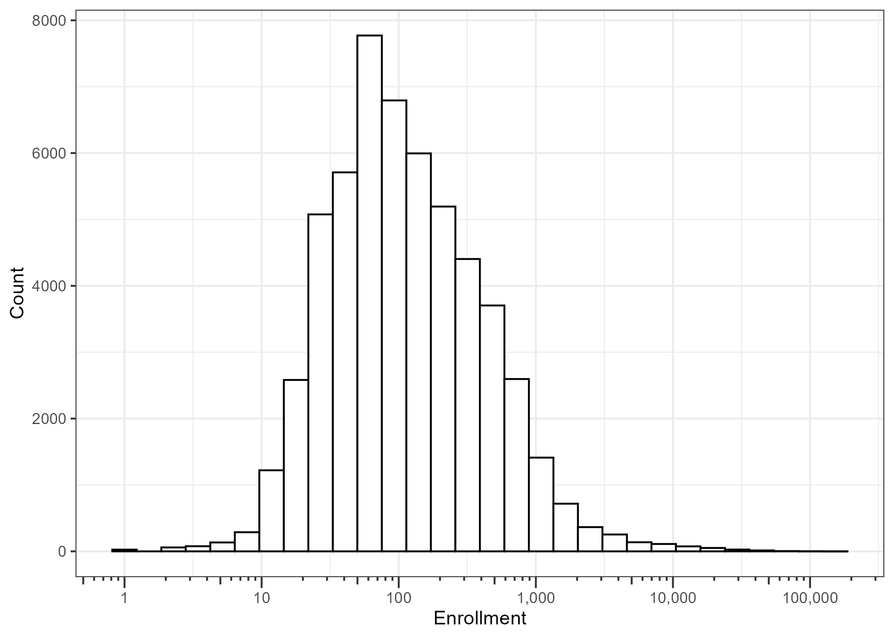
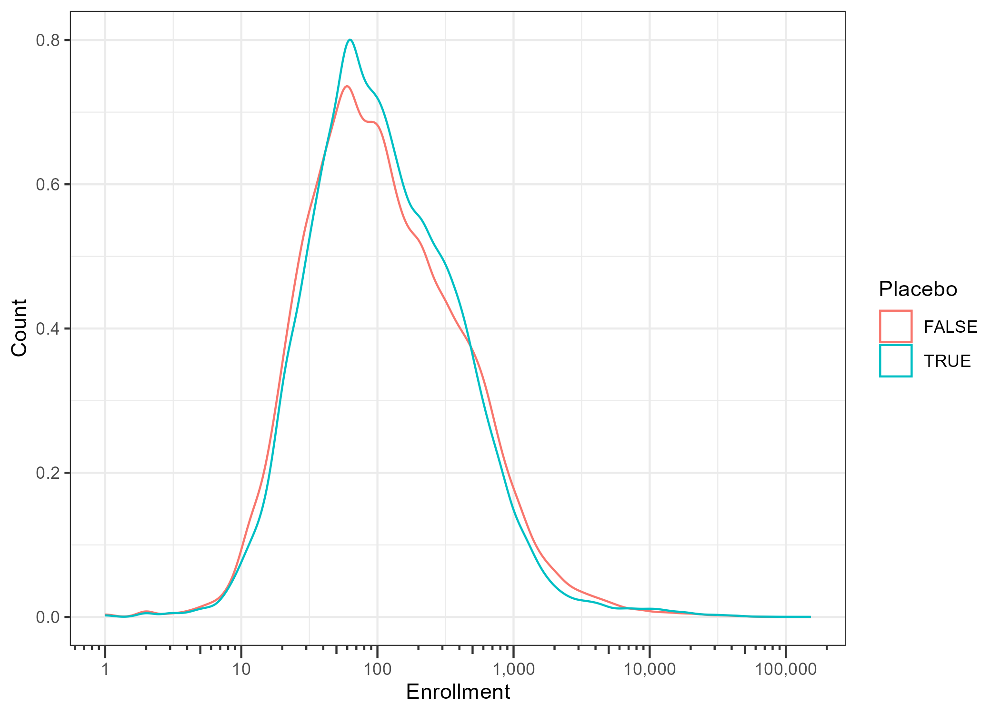
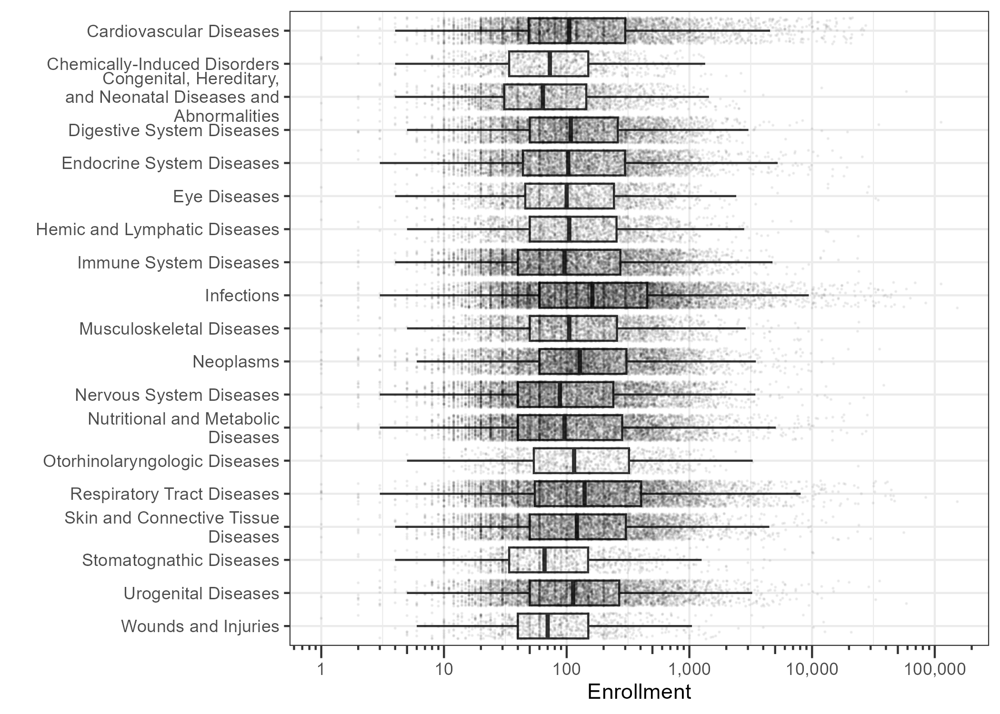
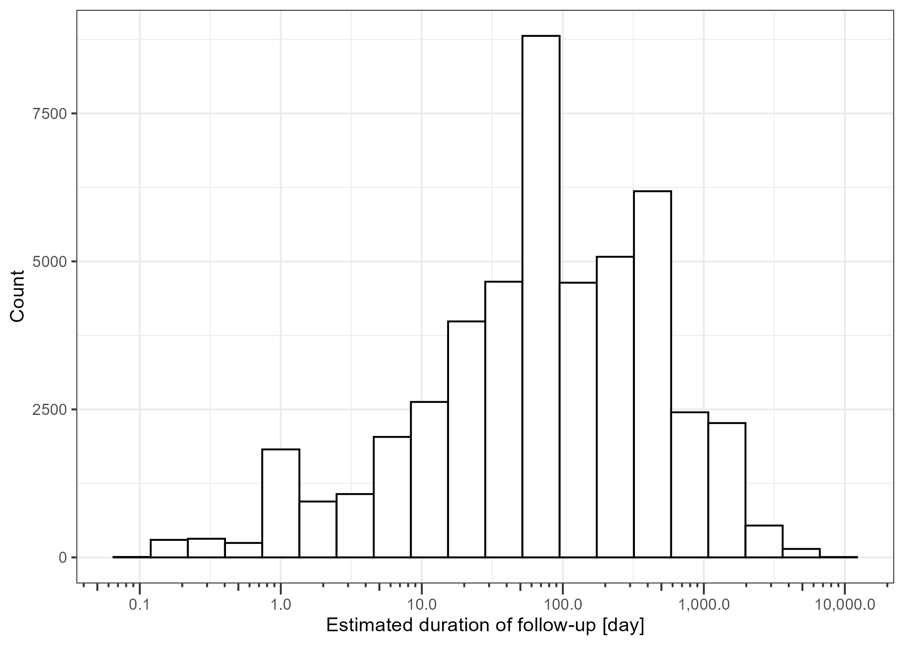
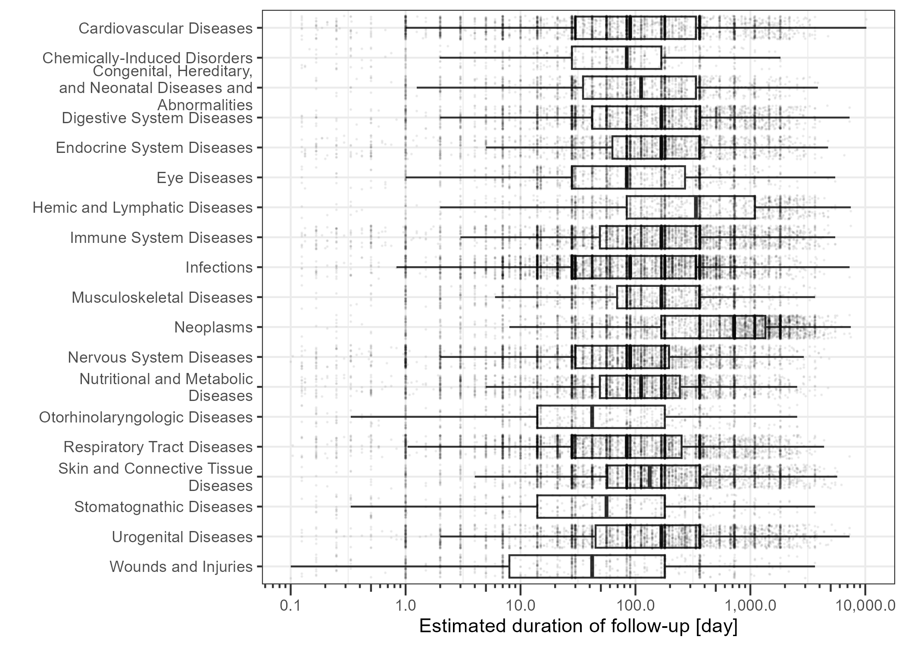
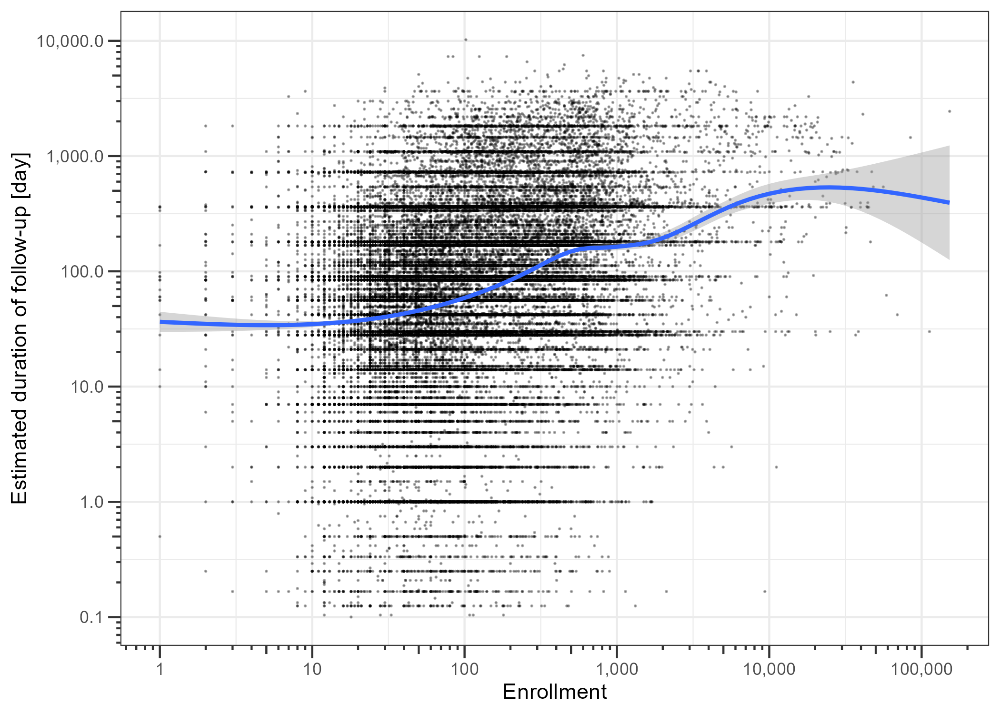

Sample size and duration of follow-up of randomized controlled clinical
trials
================
Tamás Ferenci (<tamas.ferenci@medstat.hu>)
<br>25 April, 2025

- [Motivation](#motivation)
- [Data extraction](#data-extraction)
- [Sample sizes](#sample-sizes)
- [Duration of follow-up](#duration-of-follow-up)
- [Miscellaneous](#miscellaneous)
  - [Relationship of sample size and follow-up
    duration](#relationship-of-sample-size-and-follow-up-duration)
  - [Person-years](#person-years)
- [Further development
  possibilities](#further-development-possibilities)

## Motivation

Randomized controlled trials (RCTs) are commonly referred to as the
“gold standard” for establishing the safety and efficacy of a drug, and
are now almost universally required for obtaining marketing
authorization for new pharmaceuticals. This designation is well-earned:
through randomization, RCTs can theoretically ensure that there are *no*
systematic differences *at all* between the groups being compared –
aside from their exposure to the drug. As a result, any observed
differences in outcomes – whether beneficial effects (efficacy) or
adverse effects (safety) – can be confidently attributed to the drug
itself (alongside random variability, which can be addressed
statistically), and not to other differences between groups as there are
no such differences. In other words, there is no
[confounding](https://www.annualreviews.org/content/journals/10.1146/annurev.publhealth.22.1.189).
This eliminates a fundamental – although not only – source of *bias*.

The key phrase here is “at all”: randomization implies no differences
even in unknown or unmeasured variables – even in factors we couldn’t
measure, even in factors we are not aware could act as confounders. This
stands in sharp contrast to observational studies, where we can only
adjust for *known and measured* confounders. These can be managed
through design strategies like restriction, or analytical methods such
as stratification or regression adjustment. However, these approaches
are only effective for variables we recognize as confounders and for
which we have collected data (and even then, limitations might remain,
for example, the number of confounders we can adjust for is constrained
by the study’s sample size). This is the most important strength of
RCTs: their potential to eliminate bias from confounding, giving them
unique power in evaluating drug effects.

The “theoretically” part is equally important: RCTs can be poorly
designed or executed, even in ways that reintroduce just the
confounding, or lead to other biases. Randomization failures, improper
blinding, protocol deviations etc. commonly appear in practice. However,
they at least offer the theoretical possibility of being free of
confounding in a sense of having zero bias due to it – in an
observational study we can never say, not even theoretically, that there
is “surely” no confounding.

That said, RCTs also have important limitations, two of which will be
examined here. First, RCTs typically have smaller *sample sizes* than
observational studies. The latter can often include sample sizes orders
of magnitude larger (and achieving the same sample size is also more
feasible with an observational study). Second, RCTs usually have much
shorter *duration of follow-up* than observational studies.
(Quantification of the follow-up might be
[non-trivial](https://onlinelibrary.wiley.com/doi/10.1002/pst.2300) even
in RCTs and comparison with observational studies where issues like
immortal time might appear are far from being straightforward, but these
issues will not be investigated here.) Together, these limitations mean
that RCTs tend to have lower *statistical power*. This means that small
effects – whether small desired effects, or rare side effects – may be
harder to detect in RCTs. (Side effects with delayed onset – i.e., those
that only emerge after a certain period of time rather than accumulating
linearly – are harder to detect in RCTs, due to the limited follow-up.)

But how significant is this limitation in practice? This report does not
attempt to provide a comprehensive analysis that considers all factors
together. (It is certainly possible to approach such an analysis. For
example, with an appropriate definition of error, [one can
define](https://www.fharrell.com/post/ehrs-rcts/index.html) the
“effective” sample size of an observational study as the sample size of
an unbiased RCT that would have the same error as the biased
observational study. Even for seemingly moderate bias, this can be much
smaller than the actual sample size. These issues will not be
investigated now.) Here, our aim is simply to collect empirical data on
these two limitations of RCTs, as it is instructive to look at how large
and how long RCTs can actually be to to understand these limitations. We
will investigate this using data from ClinicalTrials.gov.

The US National Library of Medicine’s ClinicalTrials.gov registry
(<https://clinicaltrials.gov/>) is a comprehensive
[database](https://clinicaltrials.gov/about-site/about-ctg) of RCTs,
launched in 2000. While submission is mandatory for trials regulated by
the FDA, sponsors and investigators from outside the US can also
register their studies. Because of its international recognition and
scope, the vast majority of significant RCTs are submitted to
ClinicalTrials.gov. This makes it an excellent resource for constructing
a broad and detailed picture of contemporary trials, both geographically
(covering studies worldwide) and temporally (spanning several decades).
It is also important that the database of ClinicalTrials.gov is publicly
accessible.

However, it’s important to acknowledge a key limitation: while
ClinicalTrials.gov likely captures nearly all relevant modern trials, it
does not include historical studies conducted before its inception. Case
in point, probably the largest RCT ever conducted was the [1954 field
trial](https://ajph.aphapublications.org/toc/ajph.1/45/5_Pt_2) of the
inactived polio vaccine of Jonas Salk which involved 400,000 children
randomized. We will miss this study and similar historical ones, but
nonetheless, we can safely say that ClinicalTrials.gov allows us to
comprehensively examine the “modern era” of drug trials.

We will use the [R environment for statistical
computing](https://www.r-project.org/) to carry out the data
downloading, extraction and analysis using packages `data.table` and
`ggplot2` among others:

``` r
library(data.table)
library(ggplot2)
theme_set(theme_bw())
```

## Data extraction

ClinicalTrials.gov has a [comfortable
API](https://clinicaltrials.gov/data-api/api) to query its database,
however, when many trials have to be downloaded, especially if we need
detailed information on them, the use of API might be slow. (The
advantage of API in this respect is that we can pre-filter the necessary
trials thereby limiting the number we download, but if that number is
still high, or if we need to download further data individually for each
trial – which will be the case here – this advantage might be offset by
the slowness of the individal downloads.) In our case, we are better off
with mass downloading all trials, and then filtering and processing
everything offline.

So first, we download the whole database (interestingly the necessary
call only seems to be documented in an [API Migration
Guide](https://www.clinicaltrials.gov/data-api/about-api/api-migration#other-endpoints)):

``` r
if(!file.exists("ctg-studies.json.zip")) {
  unlink("./ctg-studies/", recursive = TRUE)
  options(timeout = 600)
  download.file(paste0("https://clinicaltrials.gov/api/v2/",
                       "studies/download?format=json.zip"),
                "ctg-studies.json.zip")
  unzip("ctg-studies.json.zip", exdir = "./ctg-studies/")
}
```

(This code also means that to re-download the whole database, all one
has to do is to delete the `ctg-studies.json.zip` file. This will
regenerate the entire database.)

The above code downloads the data in JSON format. While the handling of
this format is more complicated than the handling of CSV format,
unfortunately CSV contains only a [subset of all
data](https://clinicaltrials.gov/data-api/about-api/csv-download) – only
JSON format contains every data, and we will use data that is not
available in CSV, hence the above choice.

As we will have many JSON files, the time necessary to read one from the
hard drive is critical, so let’s first check empirically what is the
best way (package) to do this:

``` r
bench::mark(
  jsonlite::fromJSON("./ctg-studies/NCT00744263.json"),
  rjson::fromJSON(file = "./ctg-studies/NCT00744263.json"),
  RJSONIO::fromJSON("./ctg-studies/NCT00744263.json"),
  check = FALSE
)
```

    ## Warning: Some expressions had a GC in every iteration; so filtering is
    ## disabled.

    ## # A tibble: 3 × 6
    ##   expression                            min  median `itr/sec` mem_alloc `gc/sec`
    ##   <bch:expr>                        <bch:t> <bch:t>     <dbl> <bch:byt>    <dbl>
    ## 1 "jsonlite::fromJSON(\"./ctg-stud…  60.4ms 67.68ms      14.4    1.54MB    23.3 
    ## 2 "rjson::fromJSON(file = \"./ctg-…  6.95ms  7.42ms     122.    321.2KB    12.0 
    ## 3 "RJSONIO::fromJSON(\"./ctg-studi… 14.49ms 16.37ms      56.3    1.48MB     3.89

Based on these results, we will use the `rjson` package.

Next, we extract the necessary data from the JSON files (the [Study Data
Structure](https://clinicaltrials.gov/data-api/about-api/study-data-structure)
document is useful to identify the necessary fields and their names). We
use parallel processing to speed it up:

``` r
cl <- parallel::makeCluster(parallel::detectCores() - 1)
RawData <- parallel::parLapply(cl, list.files("./ctg-studies/"), function(f)
  with(rjson::fromJSON(file = paste0("./ctg-studies/", f)),
       data.table::data.table(
         NCT = protocolSection$identificationModule$nctId,
         BriefSummary = protocolSection$descriptionModule$briefSummary,
         StudyType = protocolSection$designModule$studyType,
         DesignAllocation = protocolSection$designModule$designInfo$allocation,
         EnrollmentType = protocolSection$designModule$enrollmentInfo$type,
         Enrollment = protocolSection$designModule$enrollmentInfo$count,
         PrimaryPurpose = protocolSection$designModule$designInfo$primaryPurpose,
         InterventionType =
           list(unlist(lapply(protocolSection$armsInterventionsModule$interventions, `[[`, "type"))),
         OverallStatus = protocolSection$statusModule$overallStatus,
         DesignMasking = protocolSection$designModule$designInfo$maskingInfo$masking,
         Phase = list(protocolSection$designModule$phases),
         TargetDuration = protocolSection$designModule$targetDuration,
         Age = list(protocolSection$eligibilityModule$stdAges),
         ArmGroupType =
           list(unlist(lapply(protocolSection$armsInterventionsModule$armGroups, `[[`, "type"))),
         TimeFrame = list(unlist(c(
           lapply(protocolSection$outcomesModule$primaryOutcomes, `[[`, "timeFrame"),
           lapply(protocolSection$outcomesModule$secondaryOutcomes, `[[`, "timeFrame"),
           lapply(protocolSection$outcomesModule$otherOutcomes, `[[`, "timeFrame"),
           if(exists("resultsSection"))
             lapply(resultsSection$outcomeMeasuresModule$outcomeMeasures,
                    `[[`, "timeFrame") else NULL))),
         ConditionMeSH =
           list(unlist(lapply(derivedSection$conditionBrowseModule$meshes, `[[`, "id")))
       )
  )
)
parallel::stopCluster(cl)
RawData <- rbindlist(RawData, fill = TRUE)
```

The only thing that is not straightforward is the handling of columns
like `InterventionType`: here, the database contains (or may contain)
many values for a single cell. We will use `sapply` to extract these,
and then store them as a list – this would not be possible with an
ordinary data frame, where we could only store a single value. Luckily,
`data.table` supports the so-called list columns, which realizes just
this; we now make use of this feature. (Essentially, we use it instead
of building a relational database.) This is an especially powerful tool,
because `data.table` also supports the flexible extraction of these data
(called [unnesting](https://osf.io/preprints/psyarxiv/u8ekc_v1)). We can
also process them with ordinary `lapply` and similar functions. Finally,
when printing them (either on the console, or with `knitr::kable`) the
default mechanism without any further coding is that the values will be
shown separated with a comma which also also convenient, as this is what
we usually want. (`fwrite` also makes it easy to customize how such
fields are saved to regular CSV files.)

Once we have this database, we can narrow it down to those trials that
we need for our aim:

- `StudyType` will be set to `INTERVENTIONAL` and `DesignAllocation`
  will be set to `RANDOMIZED` to ensure that we only capture RCTs.
- `EnrollmentType` will be set to `ACTUAL`, as we will very much use
  enrollment data later, so it is important that this reflects actual
  (not estimated) enrollment.
- `PrimaryPurpose` will be set to `TREATMENT` or `PREVENTION` and
  `InterventionType` will be set to contain only `DRUG` or `BIOLOGICAL`
  or `OTHER` with containing at least one `BIOLOGICAL` or `DRUG` to
  capture only drug trials.
- `OverallStatus` will be set to `COMPLETED` to capture only completed
  trials.
- One problem is that the results will include not only individually
  randomized, but also cluster-randomized trials. We now focus only on
  individually randomized trials, so we try to remove cluster-randomized
  trials by searching for this string (and its variants) in
  `BriefSummary`.

The above considerations result in the following subsetting:

``` r
RawData <- RawData[StudyType == "INTERVENTIONAL" &
                     DesignAllocation == "RANDOMIZED" &
                     EnrollmentType == "ACTUAL" &
                     PrimaryPurpose %in% c("TREATMENT",
                                           "PREVENTION") &
                     !sapply(RawData$InterventionType, function(x)
                       any(!x %in% c("BIOLOGICAL", "DRUG",
                                     "OTHER"))) &
                     sapply(RawData$InterventionType, function(x)
                       any(x %in% c("BIOLOGICAL", "DRUG"))) &
                     OverallStatus == "COMPLETED" &
                     !grepl("cluster-randomized", BriefSummary) &
                     !grepl("cluster randomized", BriefSummary) &
                     !grepl("cluster randomised", BriefSummary)]
```

This is unfortunately not perfect in terms of cluster-randomized trials,
as some of such trials still slip through. We can manually remove these
(with a pointer here to the source where the cluster-randomized nature
can be seen):

``` r
RawData <- RawData[
  !NCT %in%
    c("NCT02027207", # 10.1016/j.vaccine.2013.10.021
      "NCT04424511", # clinicaltrials.gov
      "NCT00269542", # 10.1093/jn/137.1.112
      "NCT00289224" # 10.1016/S0140-6736(09)61297-6
    )]
```

The masking variable is somewhat noisy, so we create a cleaned version:

``` r
RawData$MaskingSimple <- ifelse(
  RawData$DesignMasking %in% c("DOUBLE", "Double",
                               "Double blind"), "DOUBLE",
  ifelse(RawData$DesignMasking %in% c("open", "NONE"), "NONE",
         ifelse(RawData$DesignMasking %in%
                  c("SINGLE", "TRIPLE", "QUADRUPLE"),
                RawData$DesignMasking, NA))
)
```

Whether the trial was controlled with placebo (as opposed to active
control) can be detected from the `ArmGroupType` field:

``` r
RawData$Placebo <- sapply(RawData$ArmGroupType, function(x)
  any(x %in% c("PLACEBO_COMPARATOR", "SHAM_COMPARATOR")))
```

This provides us with the information on the sample size, as this is
just one of the fields we have downloaded (with the name `Enrollment`).
Obtaining the duration of the follow-up is however far more complicated.

The fundamental problem is that – in contrast to sample size – duration
of follow-up is not stored as a separate, well-defined,
machine-processable field. (There is a field called `TargetDuration`,
but unfortunately it is missing in the vast majority of the cases –
actually, in all of those that we are now investigating.) The best we
have is that for the outcomes, there is a field called “time frame”,
which we can utilize. Time frames are stored at different places: there
are 3 such fields within the protocol section, and 1 among the results.
This is not mandatory, of course (some trials don’t even have results
posted). We will use every of them, which is available. There are,
however, two important limitations. First, the content of this field is
still a non-structured verbal description, hence durations need to be
extracted with text mining, which can never be perfect. Second, this
doesn’t actually inform us on the concrete follow-up, rather, as the
name suggests, it simply specifies a time frame for the given outcome.
At best, this can be considered to be a proxy for actual follow-up, but
it has to be emphasized again, that – in contrast to the sample size –
this will be only a rough measure.

We will make the following steps to extract the duration from the
fields. First, as it is usually done, we convert everything to lower
case to simplify the subsequent steps. Then we convert numbers given as
text to numbers (by a very simple replacement from 1 to 100, paying
attention only to matching just standalone words, not parts of a word).
Finally, we carry out the extraction using a regular expression that
matches two patterns: a number (possibly with decimal part) followed by
a text that points to a duration (e.g., “2.5 years” or “1 month”), or a
specifier that points to a duration followed by a number without decimal
part (e.g., “Day 30” or “Month 2”):

``` r
qrypattern <- paste0(
  "\\b\\d{1,3}((\\.|\\,)\\d{1,3})?\\s*(day|days|week|weeks|month",
  "|months|hour|hours|min|mins|minute|minutes|year|years|yr|yrs)",
  "\\b|\\b(day|week|month|year)\\s*\\d{1,3}\\b")
```

Finally, we convert the extracted durations uniformly to days using the
following function:

``` r
convtime <- function(x) {
  value <- as.numeric(stringr::str_extract(
    gsub(",", ".", x, fixed = TRUE), "\\d{1,3}(.\\d{1,3})?"))
  unit <- stringr::str_extract(x,
                               "day|week|month|hour|min|year|yr")
  value * switch(unit,
                 "day" = 1, "week" = 7, "month" = 30,
                 "hour" = 1/24, "min" = 1/3600, "year" = 365,
                 "yr" = 365)
}
```

The strategy will be that we extract every suspected duration that we
can, and – after converting them to days – we simply take the largest
one. This is arguable, but probably the best we can do to capture the
whole length of the trial.

All of this is put together and realized in a single function:

``` r
procFU <- function(x) {
  x <- tolower(x)
  x <- textclean::mgsub(
    x, pattern = paste0(" ", textclean::replace_number(1:100),
                        " "),
    replacement = paste0(" ", 1:100, " "))
  x <- sapply(unlist(stringr::str_extract_all(
    x[!is.na(x)], pattern = qrypattern)), convtime)
  if(length(x) == 0) NA else max(x, na.rm = TRUE)
}
```

The actual extraction is carried out using the power of list columns,
using parallel processing to improve speed:

``` r
cl <- parallel::makeCluster(parallel::detectCores() - 1)
parallel::clusterExport(cl, c("RawData", "procFU",
                              "convtime", "qrypattern"))
RawData$EstFU <- parallel::parSapply(cl, RawData$TimeFrame,
                                     procFU)
parallel::stopCluster(cl)
```

Unfortunately, this is still not perfect: some trials have a time frame
like “During the 7-day (Days 0-6) post-vaccination period following each
dose and across doses, for subjects between 18-64 years of age”, where
the age will be captured as duration. We now just manually erase these:

``` r
RawData[NCT %in%
          c("NCT00985088", "NCT00534638", "NCT01857206",
            "NCT01244490", "NCT04742738", "NCT04695717",
            "NCT05398848", "NCT02914652", "NCT02100436")
]$EstFU <- NA
```

The last piece of information we now try to extract is the therapeutic
area. Fortunately, the data structure contains information on this in a
module named “condition”. This includes, or may include, so-called
terms, such as “pneumonia”, an ID, such as “D011014”, which is just the
[Medical Subject Headings](https://www.nlm.nih.gov/mesh/meshhome.html)
(MeSH) identifier, and a bunch of hierarchical information (ancestors,
leaves etc). The term is hard to use, because it is not linked to the
therapeutic area. The hierarchical information would be appropriate for
this end, but – even if this information is present – it does not give a
simple linear hierarchy from which the therapeutic are could be easily
deduced. Luckily, we don’t even need this: the MeSH identifier is
unique, standardized, and – most importantly – arranged [in a
hiearchy](https://meshb.nlm.nih.gov/treeView) that can be looked up. The
[tree view](https://meshb.nlm.nih.gov/record/ui?ui=D011014) of
“pneumonia” shows that is is under the category “respiratory tract
infections”, which is under “infections”. This is the highest
hiearchical level which we will call therapeutic area. Pneumonia also
exemplifies that there might be more than one area for a given
condition: pneumonia also belongs to “lung diseases”, which is under the
highest level, i.e., therapeutic area of “respiratory tract diseases”.
Of note, these can be deduced from the so-called Tree Number of a given
condition: pneumonia has a tree number of C01.748.610 (C01.748 is
“respiratory tract infections”, C01 is “infections”) and a tree number
of C08.381.677 (C08.381 is “lung diseases”, C08 is “respiratory tract
diseases”), among others.

After
[downloading](https://www.nlm.nih.gov/databases/download/mesh.html) the
whole MeSH database in XML format, we define a few variables and
functions that allow the extraction of the above information:

``` r
meshtemp <- XML::xmlParse("desc2025.xml")
meshtempDF <- XML::xmlToDataFrame(meshtemp)
meshtemp2 <- XML::getNodeSet(meshtemp, "//DescriptorRecord")
meshtemp3 <- XML::xmlValue(XML::getNodeSet(
  meshtemp, "//DescriptorRecord/DescriptorUI"))
extrdisease <- function(meshs)
  unique(unlist(lapply(meshs[!is.na(meshs)], function(mesh)
    unique(sapply(XML::xmlToList(XML::xmlChildren(
      meshtemp2[[which(meshtemp3 == mesh)]])$TreeNumberList),
      substring, 1, 3)))))
```

Using this, we extract the highest hiearchical level, i.e., the
therapeutic area for each MeSH identifier:

``` r
RawData$ConditionMeSHHead <- lapply(RawData$ConditionMeSH,
                                    extrdisease)
```

Note that this returns *all* therapeutic areas (as we have seen for the
example of pneumonia, there may be more than one for a given condition).

We also extract the human-readable names of the therapeutic areas for
better labelling of the plots:

``` r
ConditionMeSHTable <- rbindlist(lapply(unique(unlist(RawData$ConditionMeSHHead)), function(head)
  data.table(ConditionMeSHHead = head,
             ConditionMeSHHeadName = meshtempDF[
               !is.na(meshtempDF$TreeNumberList) &
                 meshtempDF$TreeNumberList == head, "DescriptorName"])))
ConditionMeSHTable$Main <- substring(ConditionMeSHTable$ConditionMeSHHead, 1, 1)
ConditionMeSHTable <- ConditionMeSHTable[Main == "C" & ConditionMeSHHead != "C23"]
ConditionMeSHTable$ConditionMeSHHeadNamePrint <- stringr::str_wrap(ConditionMeSHTable$ConditionMeSHHeadName, 30)
knitr::kable(ConditionMeSHTable[order(ConditionMeSHHead)][
  , .(`MeSH name` = ConditionMeSHHeadName,
      `MeSH Tree ID` = ConditionMeSHHead)])
```

| MeSH name | MeSH Tree ID |
|:---|:---|
| Infections | C01 |
| Neoplasms | C04 |
| Musculoskeletal Diseases | C05 |
| Digestive System Diseases | C06 |
| Stomatognathic Diseases | C07 |
| Respiratory Tract Diseases | C08 |
| Otorhinolaryngologic Diseases | C09 |
| Nervous System Diseases | C10 |
| Eye Diseases | C11 |
| Urogenital Diseases | C12 |
| Cardiovascular Diseases | C14 |
| Hemic and Lymphatic Diseases | C15 |
| Congenital, Hereditary, and Neonatal Diseases and Abnormalities | C16 |
| Skin and Connective Tissue Diseases | C17 |
| Nutritional and Metabolic Diseases | C18 |
| Endocrine System Diseases | C19 |
| Immune System Diseases | C20 |
| Disorders of Environmental Origin | C21 |
| Animal Diseases | C22 |
| Occupational Diseases | C24 |
| Chemically-Induced Disorders | C25 |
| Wounds and Injuries | C26 |

(We limit ourselves to “C”, which is “Diseases”, and we exclude “C23”
which is “Pathological Conditions, Signs and Symptoms”.)

Finally, we create a table containing the therapeutic areas and the
extracted information (sample size, duration of follow-up) from the
trials. We will make use of the above-mentioned unnesting feature: a
trial with more than one therapeutic area will appear in *every* of its
therapeutic areas. We also save information on how many trials appear in
a given thereaputic area, so that later we will be able to exclude very
small areas from the plots.

``` r
RawDataMeSH <- RawData[, .(ConditionMeSHHead = unlist(ConditionMeSHHead)), .(Enrollment, EstFU, NCT)]
RawDataMeSH <- merge(RawDataMeSH,
                     RawDataMeSH[, .N, .(ConditionMeSHHead)],
                     by = "ConditionMeSHHead")
RawDataMeSH <- merge(RawDataMeSH, ConditionMeSHTable,
                     by = "ConditionMeSHHead")
```

To conclude our work, let’s save the results to facilitate further
processing:

``` r
RawData$TimeFrame <- ifelse(lapply(RawData$TimeFrame, is.null),
                            NA, RawData$TimeFrame)
RawData$ArmGroupType <- ifelse(
  lapply(RawData$ArmGroupType, is.null), NA, RawData$ArmGroupType)
RawData$ConditionMeSH <- ifelse(
  lapply(RawData$ConditionMeSH, is.null), NA,
  RawData$ConditionMeSH)
RawData$ConditionMeSHHead <- ifelse(
  lapply(RawData$ConditionMeSHHead, is.null),
  NA, RawData$ConditionMeSHHead)
fwrite(RawData, "ClinicalTrialsGov-data.csv")
zip::zip("ClinicalTrialsGov-data.zip",
         "ClinicalTrialsGov-data.csv")
saveRDS(RawData, "ClinicalTrialsGov-data.rds")
```

Thus, it’ll be available both in (compressed)
[CSV](https://github.com/tamas-ferenci/clinical-trial-size-duration/blob/main/ClinicalTrialsGov-data.zip)
and in
[RDS](https://github.com/tamas-ferenci/clinical-trial-size-duration/blob/main/ClinicalTrialsGov-data.rds)
formats.

## Sample sizes

First, lets start with visualizing the distribution of the sample sizes
(note that the horizontal scale is logarithmic!):

``` r
ggplot(RawData[Enrollment > 0], aes(x = Enrollment)) +
  geom_histogram(color = "black", fill = "white", bins = 30) +
  scale_x_log10(breaks = scales::breaks_log(n = 6),
                labels = scales::label_comma(),
                guide = "axis_logticks") +
  labs(y = "Count")
```



A few noteworthy quantiles:

``` r
ps <- c(0.5, 0.75, 0.9, 0.99, 0.999)
knitr::kable(data.table(`Percentile` = ps * 100,
                        `Sample size` =
                          quantile(RawData$Enrollment, ps)),
             digits = c(1, 0))
```

| Percentile | Sample size |
|-----------:|------------:|
|       50.0 |         100 |
|       75.0 |         262 |
|       90.0 |         606 |
|       99.0 |        3686 |
|       99.9 |       22160 |

Or, the other way around, a few noteworthy points of the cumulative
distribution function:

``` r
ns <- c(0.01, 0.02, 0.05, 0.1, 0.2, 0.5,
        1, 2, 5, 10, 20, 50) * 1e3
knitr::kable(data.table(`Sample size` = ns,
                        `Proportion of trials smaller [%]` =
                          sapply(ns, function(n)
                            mean(RawData$Enrollment < n) * 100)),
             digits = c(0, 2))
```

| Sample size | Proportion of trials smaller \[%\] |
|------------:|-----------------------------------:|
|          10 |                               1.07 |
|          20 |                               6.03 |
|          50 |                              27.69 |
|         100 |                              49.74 |
|         200 |                              68.30 |
|         500 |                              87.00 |
|        1000 |                              94.99 |
|        2000 |                              98.03 |
|        5000 |                              99.29 |
|       10000 |                              99.65 |
|       20000 |                              99.87 |
|       50000 |                              99.99 |

Returning to the visualizations, it might be interesting to compare
different types. For example, the distribution according to whether the
comparator is placebo or not:

``` r
ggplot(RawData[Enrollment > 0], aes(x = Enrollment)) +
  geom_density(aes(group = Placebo, color = Placebo)) +
  scale_x_log10(breaks = scales::breaks_log(n = 6),
                labels = scales::label_comma(),
                guide = "axis_logticks") +
  labs(y = "Count")
```



It is especially instructive to have a look at the distribution of
sample sizes for different therapeutic areas (plot will only show those
areas for which we have at least 100 trials):

``` r
ggplot(RawDataMeSH[N > 100 & Enrollment > 0],
       aes(y = ConditionMeSHHeadNamePrint, x = Enrollment)) +
  geom_boxplot(outliers = FALSE) +
  geom_jitter(size = 0.1, alpha = 0.05) +
  scale_x_log10(breaks = scales::breaks_log(n = 6),
                labels = scales::label_comma(),
                guide = "axis_logticks") + 
  scale_y_discrete(limits = rev) +
  labs(y = "")
```



Now we can have a look at the few largest trials:

``` r
knitr::kable(RawData[
  order(Enrollment, decreasing = TRUE),
  .(NCT = paste0("[", NCT, "](https://clinicaltrials.gov/study/", NCT, ")"),
    Phase, Masking = MaskingSimple, Placebo, Age,
    Enrollment)][1:10])
```

| NCT | Phase | Masking | Placebo | Age | Enrollment |
|:---|:---|:---|:---|:---|---:|
| [NCT02079701](https://clinicaltrials.gov/study/NCT02079701) | PHASE4 | TRIPLE | TRUE | CHILD , ADULT , OLDER_ADULT | 152723 |
| [NCT01014845](https://clinicaltrials.gov/study/NCT01014845) | PHASE3 | QUADRUPLE | TRUE | CHILD , ADULT , OLDER_ADULT | 112604 |
| [NCT00744263](https://clinicaltrials.gov/study/NCT00744263) | PHASE4 | QUADRUPLE | TRUE | OLDER_ADULT | 84496 |
| [NCT00090233](https://clinicaltrials.gov/study/NCT00090233) | PHASE3 | DOUBLE | TRUE | CHILD | 69274 |
| [NCT00140673](https://clinicaltrials.gov/study/NCT00140673) | PHASE3 | QUADRUPLE | FALSE | CHILD | 63227 |
| [NCT03871491](https://clinicaltrials.gov/study/NCT03871491) | PHASE3 | TRIPLE | TRUE | ADULT | 58747 |
| [NCT03490123](https://clinicaltrials.gov/study/NCT03490123) | PHASE4 | SINGLE | FALSE | CHILD , ADULT , OLDER_ADULT | 56000 |
| [NCT04966702](https://clinicaltrials.gov/study/NCT04966702) | PHASE3 | NONE | FALSE | CHILD , ADULT , OLDER_ADULT | 48145 |
| [NCT04368728](https://clinicaltrials.gov/study/NCT04368728) | PHASE2, PHASE3 | TRIPLE | TRUE | CHILD , ADULT , OLDER_ADULT | 47079 |
| [NCT05540522](https://clinicaltrials.gov/study/NCT05540522) | PHASE3 | QUADRUPLE | FALSE | ADULT , OLDER_ADULT | 46169 |

Restring ourselves only to placebo-controlled, blinded RCTs:

``` r
knitr::kable(RawData[MaskingSimple != "NONE" & Placebo == TRUE][
  order(Enrollment, decreasing = TRUE),
  .(NCT = paste0("[", NCT, "](https://clinicaltrials.gov/study/", NCT, ")"),
    Phase, Masking = MaskingSimple, Placebo, Age,
    Enrollment)][1:10])
```

| NCT | Phase | Masking | Placebo | Age | Enrollment |
|:---|:---|:---|:---|:---|---:|
| [NCT02079701](https://clinicaltrials.gov/study/NCT02079701) | PHASE4 | TRIPLE | TRUE | CHILD , ADULT , OLDER_ADULT | 152723 |
| [NCT01014845](https://clinicaltrials.gov/study/NCT01014845) | PHASE3 | QUADRUPLE | TRUE | CHILD , ADULT , OLDER_ADULT | 112604 |
| [NCT00744263](https://clinicaltrials.gov/study/NCT00744263) | PHASE4 | QUADRUPLE | TRUE | OLDER_ADULT | 84496 |
| [NCT00090233](https://clinicaltrials.gov/study/NCT00090233) | PHASE3 | DOUBLE | TRUE | CHILD | 69274 |
| [NCT03871491](https://clinicaltrials.gov/study/NCT03871491) | PHASE3 | TRIPLE | TRUE | ADULT | 58747 |
| [NCT04368728](https://clinicaltrials.gov/study/NCT04368728) | PHASE2, PHASE3 | TRIPLE | TRUE | CHILD , ADULT , OLDER_ADULT | 47079 |
| [NCT01138449](https://clinicaltrials.gov/study/NCT01138449) | NA | QUADRUPLE | TRUE | CHILD | 44984 |
| [NCT04526990](https://clinicaltrials.gov/study/NCT04526990) | PHASE3 | QUADRUPLE | TRUE | ADULT , OLDER_ADULT | 44247 |
| [NCT04510207](https://clinicaltrials.gov/study/NCT04510207) | PHASE3 | QUADRUPLE | TRUE | ADULT , OLDER_ADULT | 44101 |
| [NCT04652102](https://clinicaltrials.gov/study/NCT04652102) | PHASE2, PHASE3 | DOUBLE | TRUE | ADULT , OLDER_ADULT | 39680 |

And those that involved only children:

``` r
knitr::kable(RawData[MaskingSimple != "NONE" & Placebo == TRUE & Age == "CHILD"][
  order(Enrollment, decreasing = TRUE),
  .(NCT = paste0("[", NCT, "](https://clinicaltrials.gov/study/", NCT, ")"),
    Phase, Masking = MaskingSimple, Placebo, Age,
    Enrollment)][1:10])
```

| NCT | Phase | Masking | Placebo | Age | Enrollment |
|:---|:---|:---|:---|:---|---:|
| [NCT00090233](https://clinicaltrials.gov/study/NCT00090233) | PHASE3 | DOUBLE | TRUE | CHILD | 69274 |
| [NCT01138449](https://clinicaltrials.gov/study/NCT01138449) | NA | QUADRUPLE | TRUE | CHILD | 44984 |
| [NCT03682653](https://clinicaltrials.gov/study/NCT03682653) | PHASE4 | QUADRUPLE | TRUE | CHILD | 21832 |
| [NCT01374516](https://clinicaltrials.gov/study/NCT01374516) | PHASE3 | QUADRUPLE | TRUE | CHILD | 20869 |
| [NCT01680679](https://clinicaltrials.gov/study/NCT01680679) | PHASE4 | QUADRUPLE | TRUE | CHILD | 18163 |
| [NCT00114868](https://clinicaltrials.gov/study/NCT00114868) | PHASE3 | QUADRUPLE | TRUE | CHILD | 14035 |
| [NCT04796896](https://clinicaltrials.gov/study/NCT04796896) | PHASE2, PHASE3 | QUADRUPLE | TRUE | CHILD | 11950 |
| [NCT04992260](https://clinicaltrials.gov/study/NCT04992260) | PHASE3 | DOUBLE | TRUE | CHILD | 11349 |
| [NCT01373281](https://clinicaltrials.gov/study/NCT01373281) | PHASE3 | QUADRUPLE | TRUE | CHILD | 10275 |
| [NCT01508247](https://clinicaltrials.gov/study/NCT01508247) | PHASE3 | TRIPLE | TRUE | CHILD | 10245 |

## Duration of follow-up

Emphasizing again that this is just a rough estimate, let’s now
visualize the distribution of the duration of the follow-up (for studies
where it was more than 0.1 days):

``` r
ggplot(RawData[!is.na(EstFU) & EstFU > 0.1], aes(x = EstFU)) +
  geom_histogram(color = "black", fill = "white", bins = 20) +
  scale_x_log10(breaks = scales::breaks_log(n = 6),
                labels = scales::label_comma(),
                guide = "axis_logticks") +
  labs(x = "Estimated duration of follow-up [day]", y = "Count")
```



A few noteworthy quantiles:

``` r
ps <- c(0.5, 0.75, 0.9, 0.99, 0.999)
knitr::kable(data.table(`Percentile` = ps * 100,
                        `Duration of follow-up` =
                          quantile(RawData$EstFU, ps,
                                   na.rm = TRUE)),
             digits = c(1, 0))
```

| Percentile | Duration of follow-up |
|-----------:|----------------------:|
|       50.0 |                    84 |
|       75.0 |                   252 |
|       90.0 |                   720 |
|       99.0 |                  2190 |
|       99.9 |                  4026 |

Or, the other way around, a few noteworthy points of the cumulative
distribution function:

``` r
durs <- c(0.1, 0.5, 1, 5, 10, 50, 100, 500, 1000, 5000)
knitr::kable(data.table(`Duration of follow-up [day]` =
                          format(durs, scientific = FALSE),
                        `Proportion of trials shorter [%]` =
                          sapply(durs, function(dur)
                            mean(RawData$EstFU < dur,
                                 na.rm = TRUE) * 100)),
             digits = c(NA, 2))
```

| Duration of follow-up \[day\] | Proportion of trials shorter \[%\] |
|:------------------------------|-----------------------------------:|
| 0.1                           |                               3.12 |
| 0.5                           |                               4.44 |
| 1.0                           |                               4.94 |
| 5.0                           |                              12.61 |
| 10.0                          |                              16.91 |
| 50.0                          |                              39.20 |
| 100.0                         |                              57.72 |
| 500.0                         |                              87.59 |
| 1000.0                        |                              93.86 |
| 5000.0                        |                              99.96 |

Let’s have a look at the distribution of durations for different
therapeutic areas (plot will only show those areas for which we have at
least 100 trials):

``` r
ggplot(RawDataMeSH[N > 100 & !is.na(EstFU) & EstFU > 0.1],
       aes(y = ConditionMeSHHeadNamePrint, x = EstFU)) +
  geom_boxplot(outliers = FALSE) +
  geom_jitter(size = 0.1, alpha = 0.05) +
  scale_x_log10(breaks = scales::breaks_log(n = 6),
                labels = scales::label_comma(),
                guide = "axis_logticks") + 
  scale_y_discrete(limits = rev) +
  labs(x = "Estimated duration of follow-up [day]", y = "")
```



Now we can have a look at the few longest trials:

``` r
knitr::kable(RawData[
  order(EstFU, decreasing = TRUE),
  .(NCT = paste0("[", NCT, "](https://clinicaltrials.gov/study/", NCT, ")"),
    Phase, Masking = MaskingSimple, Placebo, Age,
    `Estimated FU [day]` = EstFU)][1:10])
```

| NCT | Phase | Masking | Placebo | Age | Estimated FU \[day\] |
|:---|:---|:---|:---|:---|---:|
| [NCT02138006](https://clinicaltrials.gov/study/NCT02138006) | NA | NONE | FALSE | ADULT | 10220.0 |
| [NCT00549848](https://clinicaltrials.gov/study/NCT00549848) | PHASE3 | NONE | FALSE | CHILD, ADULT | 7482.5 |
| [NCT00289757](https://clinicaltrials.gov/study/NCT00289757) | PHASE4 | NONE | FALSE | ADULT | 7300.0 |
| [NCT01160978](https://clinicaltrials.gov/study/NCT01160978) | PHASE2, PHASE3 | QUADRUPLE | FALSE | ADULT , OLDER_ADULT | 7300.0 |
| [NCT03370367](https://clinicaltrials.gov/study/NCT03370367) | PHASE3 | SINGLE | TRUE | ADULT , OLDER_ADULT | 7300.0 |
| [NCT06601205](https://clinicaltrials.gov/study/NCT06601205) | PHASE2, PHASE3 | QUADRUPLE | TRUE | ADULT , OLDER_ADULT | 7300.0 |
| [NCT00159536](https://clinicaltrials.gov/study/NCT00159536) | PHASE3 | QUADRUPLE | TRUE | ADULT | 6570.0 |
| [NCT00002529](https://clinicaltrials.gov/study/NCT00002529) | PHASE3 | NONE | FALSE | CHILD , ADULT , OLDER_ADULT | 6205.0 |
| [NCT00281658](https://clinicaltrials.gov/study/NCT00281658) | PHASE3 | DOUBLE | FALSE | ADULT , OLDER_ADULT | 5700.0 |
| [NCT00002651](https://clinicaltrials.gov/study/NCT00002651) | PHASE3 | NONE | FALSE | ADULT , OLDER_ADULT | 5475.0 |

Restring ourselves only to place-controlled, blinded RCTs:

``` r
knitr::kable(RawData[MaskingSimple != "NONE" & Placebo == TRUE][
  order(EstFU, decreasing = TRUE),
  .(NCT = paste0("[", NCT, "](https://clinicaltrials.gov/study/", NCT, ")"),
    Phase, Masking = MaskingSimple, Placebo, Age,
    `Estimated FU [day]` = EstFU)][1:10])
```

| NCT | Phase | Masking | Placebo | Age | Estimated FU \[day\] |
|:---|:---|:---|:---|:---|---:|
| [NCT03370367](https://clinicaltrials.gov/study/NCT03370367) | PHASE3 | SINGLE | TRUE | ADULT , OLDER_ADULT | 7300.0 |
| [NCT06601205](https://clinicaltrials.gov/study/NCT06601205) | PHASE2, PHASE3 | QUADRUPLE | TRUE | ADULT , OLDER_ADULT | 7300.0 |
| [NCT00159536](https://clinicaltrials.gov/study/NCT00159536) | PHASE3 | QUADRUPLE | TRUE | ADULT | 6570.0 |
| [NCT01989572](https://clinicaltrials.gov/study/NCT01989572) | PHASE3 | DOUBLE | TRUE | ADULT , OLDER_ADULT | 5475.0 |
| [NCT00073528](https://clinicaltrials.gov/study/NCT00073528) | PHASE3 | QUADRUPLE | TRUE | ADULT , OLDER_ADULT | 5110.0 |
| [NCT00703326](https://clinicaltrials.gov/study/NCT00703326) | PHASE3 | DOUBLE | TRUE | ADULT , OLDER_ADULT | 4489.5 |
| [NCT00006392](https://clinicaltrials.gov/study/NCT00006392) | PHASE3 | QUADRUPLE | TRUE | ADULT , OLDER_ADULT | 4380.0 |
| [NCT00090285](https://clinicaltrials.gov/study/NCT00090285) | PHASE3 | DOUBLE | TRUE | CHILD, ADULT | 4380.0 |
| [NCT01502969](https://clinicaltrials.gov/study/NCT01502969) | PHASE2, PHASE3 | TRIPLE | TRUE | CHILD | 4380.0 |
| [NCT02908685](https://clinicaltrials.gov/study/NCT02908685) | PHASE2 | DOUBLE | TRUE | CHILD, ADULT | 4380.0 |

And those that involved only children:

``` r
knitr::kable(RawData[MaskingSimple != "NONE" & Placebo == TRUE & Age == "CHILD"][
  order(EstFU, decreasing = TRUE),
  .(NCT = paste0("[", NCT, "](https://clinicaltrials.gov/study/", NCT, ")"),
    Phase, Masking = MaskingSimple, Placebo, Age,
    `Estimated FU [day]` = EstFU)][1:10])
```

| NCT | Phase | Masking | Placebo | Age | Estimated FU \[day\] |
|:---|:---|:---|:---|:---|---:|
| [NCT01502969](https://clinicaltrials.gov/study/NCT01502969) | PHASE2, PHASE3 | TRIPLE | TRUE | CHILD | 4380.0 |
| [NCT00092547](https://clinicaltrials.gov/study/NCT00092547) | PHASE3 | DOUBLE | TRUE | CHILD | 3780.0 |
| [NCT01394887](https://clinicaltrials.gov/study/NCT01394887) | PHASE2, PHASE3 | TRIPLE | TRUE | CHILD | 3650.0 |
| [NCT01648634](https://clinicaltrials.gov/study/NCT01648634) | PHASE3 | DOUBLE | TRUE | CHILD | 3650.0 |
| [NCT00033917](https://clinicaltrials.gov/study/NCT00033917) | PHASE3 | DOUBLE | TRUE | CHILD | 2920.0 |
| [NCT00568698](https://clinicaltrials.gov/study/NCT00568698) | PHASE1, PHASE2 | DOUBLE | TRUE | CHILD | 2920.0 |
| [NCT03364868](https://clinicaltrials.gov/study/NCT03364868) | PHASE2 | QUADRUPLE | TRUE | CHILD | 2737.5 |
| [NCT00152542](https://clinicaltrials.gov/study/NCT00152542) | PHASE3 | QUADRUPLE | TRUE | CHILD | 2555.0 |
| [NCT00558454](https://clinicaltrials.gov/study/NCT00558454) | PHASE4 | QUADRUPLE | TRUE | CHILD | 2555.0 |
| [NCT00830531](https://clinicaltrials.gov/study/NCT00830531) | PHASE1 | TRIPLE | TRUE | CHILD | 2555.0 |

## Miscellaneous

### Relationship of sample size and follow-up duration

It is interesting to check if there is any relationship between the
sample size and the duration of the follow-up:

``` r
ggplot(RawData[Enrollment > 0 & !is.na(EstFU) & EstFU > 0.1],
       aes(x = Enrollment, y = EstFU)) +
  geom_point(size = 0.1, alpha = 0.3) +
  scale_x_log10(breaks = scales::breaks_log(n = 6),
                labels = scales::label_comma(),
                guide = "axis_logticks") +
  scale_y_log10(breaks = scales::breaks_log(n = 6),
                labels = scales::label_comma(),
                guide = "axis_logticks") +
  geom_smooth(method = "gam", formula = y ~ s(x, bs = "cs")) +
  labs(y = "Estimated duration of follow-up [day]")
```



### Person-years

Given the uncertainty in the estimation of the follow-up duration, this
is also somewhat approximate, but let’s check what trials had the
largest follow-up in terms of person-years:

``` r
RawData$PY <- RawData$Enrollment * RawData$EstFU
knitr::kable(
  RawData[order(PY, decreasing = TRUE),
          .(NCT = paste0("[", NCT, "](https://clinicaltrials.gov/study/", NCT, ")"),
            Phase, Masking = MaskingSimple, Placebo,
            Age, Enrollment, `Estimated FU [day]` = EstFU,
            `PY [M]` = PY/1e6)][1:10],
  digits = c(NA, NA, NA, NA, NA, 0, 1, 1))
```

| NCT | Phase | Masking | Placebo | Age | Enrollment | Estimated FU \[day\] | PY \[M\] |
|:---|:---|:---|:---|:---|---:|---:|---:|
| [NCT02079701](https://clinicaltrials.gov/study/NCT02079701) | PHASE4 | TRIPLE | TRUE | CHILD , ADULT , OLDER_ADULT | 152723 | 2445.5 | 373.5 |
| [NCT00006392](https://clinicaltrials.gov/study/NCT00006392) | PHASE3 | QUADRUPLE | TRUE | ADULT , OLDER_ADULT | 35533 | 4380.0 | 155.6 |
| [NCT00744263](https://clinicaltrials.gov/study/NCT00744263) | PHASE4 | QUADRUPLE | TRUE | OLDER_ADULT | 84496 | 1449.1 | 122.4 |
| [NCT00861380](https://clinicaltrials.gov/study/NCT00861380) | PHASE3 | DOUBLE | FALSE | CHILD | 41188 | 2310.0 | 95.1 |
| [NCT00202878](https://clinicaltrials.gov/study/NCT00202878) | PHASE3 | TRIPLE | FALSE | ADULT , OLDER_ADULT | 18144 | 3285.0 | 59.6 |
| [NCT00322972](https://clinicaltrials.gov/study/NCT00322972) | PHASE4 | SINGLE | FALSE | CHILD , ADULT , OLDER_ADULT | 33000 | 1440.0 | 47.5 |
| [NCT01949857](https://clinicaltrials.gov/study/NCT01949857) | PHASE4 | TRIPLE | FALSE | CHILD , ADULT , OLDER_ADULT | 35000 | 1290.0 | 45.1 |
| [NCT01374516](https://clinicaltrials.gov/study/NCT01374516) | PHASE3 | QUADRUPLE | TRUE | CHILD | 20869 | 2160.0 | 45.1 |
| [NCT01506986](https://clinicaltrials.gov/study/NCT01506986) | PHASE4 | QUADRUPLE | TRUE | ADULT , OLDER_ADULT | 30024 | 1460.0 | 43.8 |
| [NCT02185417](https://clinicaltrials.gov/study/NCT02185417) | PHASE3 | NONE | FALSE | OLDER_ADULT | 20723 | 1971.0 | 40.8 |

## Further development possibilities

- Better identification of cluster-randomized trials.
- Better extraction of the durations from the
  `outcomeMeasures.timeFrame` fields.
- More investigations of the possible predictors (such as the
  placebo-control done above).
- Investigation if we miss anything with excluding trials when the
  enrollment was only estimated.
- Differentiating inert and non-inert placebos (sometimes found in
  [vaccine](https://www.sciencedirect.com/science/article/pii/S0264410X14005374)
  [trials](https://iris.who.int/bitstream/handle/10665/94056/9789241506250_eng.pdf)).
  E.g., NCT01014845, NCT01680679.
- Errors in ClinicalTrials.gov database: NCT04505722
  (placebo-controlled), NCT00000479 (placebo listed as “behavioral”
  intervention), NCT02211729 (placebo-controlled), NCT00281658
  (placebo-controlled).
- Checking start and end dates as possibly proxy for duration of
  follow-up.
- Elegant processing and information look-up from the MeSH XML.
